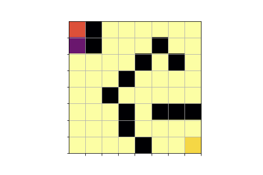
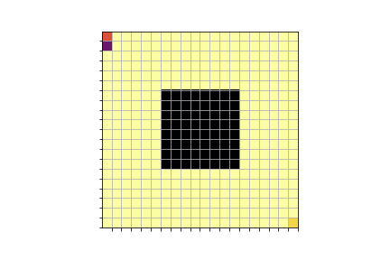
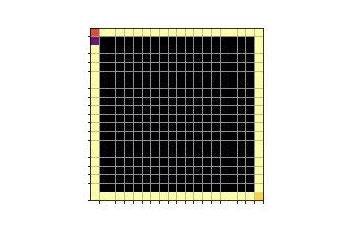
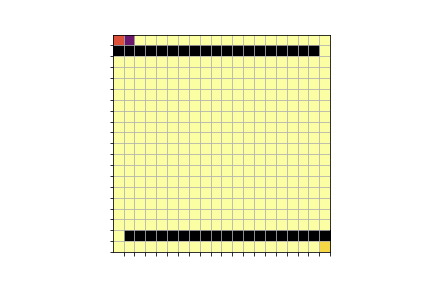
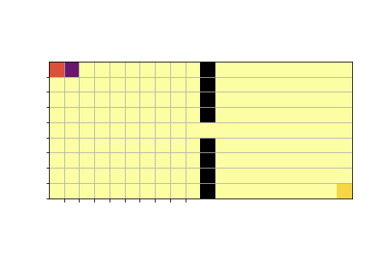
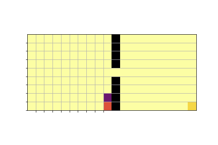

# Reinforcement Learning - Maze

**environment:** maze, on which a rat is trying to catch cheese  
**agent:** neural network

TODO: more information (q-learning, Bellmann-Equation, etc.)
### A few examples
#### 8x8 maze

#### 20x20 maze

#### 9x20 maze

